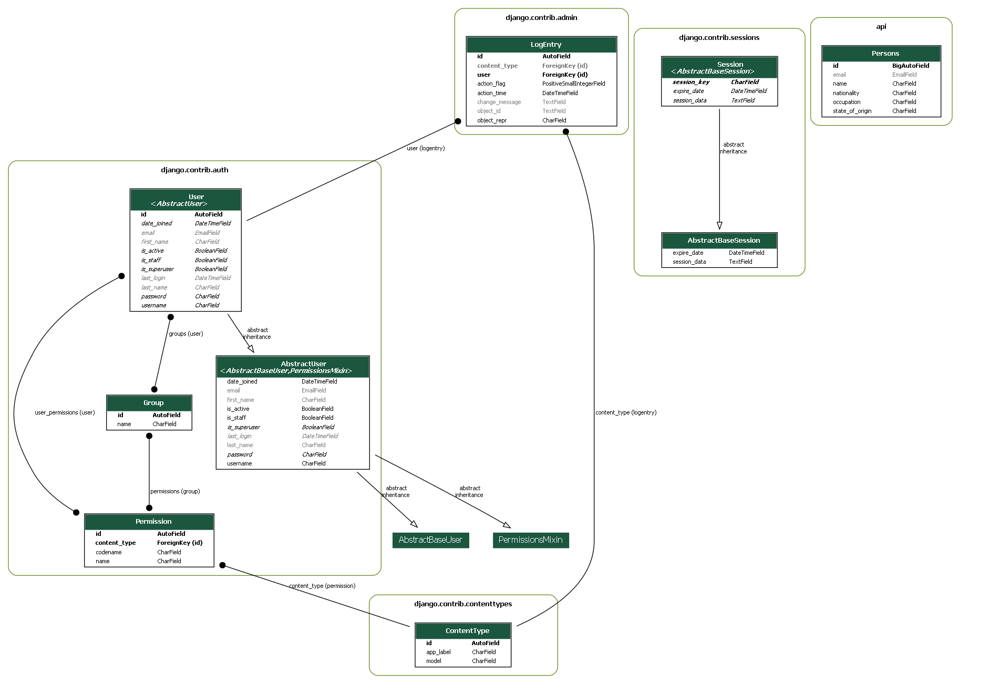

## Task for HNGX stage 2

### This is a basic api that was created using django and the Django Rest Framework

#### About the API service

  This is an API service that performs CRUD operation. You can create a user or an individual just by providing the the users credentails such as :
  - The user's name
  - The user's email
  - The user's nationality
  - The user's state_of_origin
  - The user's occupation
  #### To understand the relations of the models used during the build process take a look at the UML Diagram


  
  #### Want to know how to use this API? Read the [Documentation](https://api-person-service.onrender.com/)
  ##### Reasons why you may want to use tthis API service
- [Good and Extensive Documentation](https://api-person-service.onrender.com/)
- Greate Community Supports
- Easy to use and access
#### To step up the project locally
follow the guidelines below to setup this project locally:
- [fork this repository](https://github.com/Kingsley-Opara/Basic-API-with-django)
```
    mkdir hng_api (You could name it whatever you want)
    cd hng_api (the name of the directory you created)
```
- git clone [https://github.com/Kingsley-Opara/Basic-API-with-django](https://github.com/Kingsley-Opara/Basic-API-with-django)
- create a python virtual environment:
    ```py
        python -m venv venv
    ```
- Activate the virtual environment:
    -   On windows:
        ```py
            .venv//scripts/activate
        ```
    - On Mac or linux:
    ```py
        ./venv/bin/activate
    ```
- Install all the dependences:
    ```py
        pip install -r requirements.txt
    ```
- Setup the following environment variables:
    - AWS_ACCESS_KEY 
    - AWS_SECRET_ACCESS_KEY 
    - AWS_STORAGE_BUCKET_NAME
    - AWS_S3_REGION_NAME
    - DEBUG

    - AWS_READY

    - SECRET_KEY

    - POSTGRES_DB
    - POSTGRES_USER
    - POSTGRES_PASSWORD
    - POSTGRES_HOST
    - POSTGRES_PORT
- Ensure you are setting DEBUG to False in order to run the project locally
